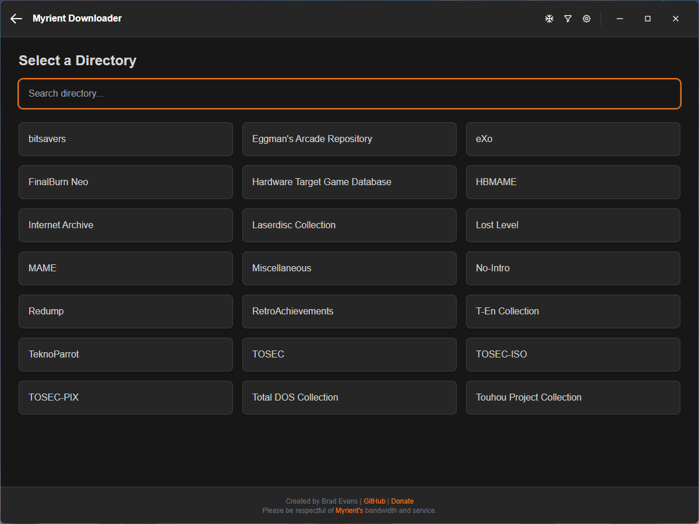
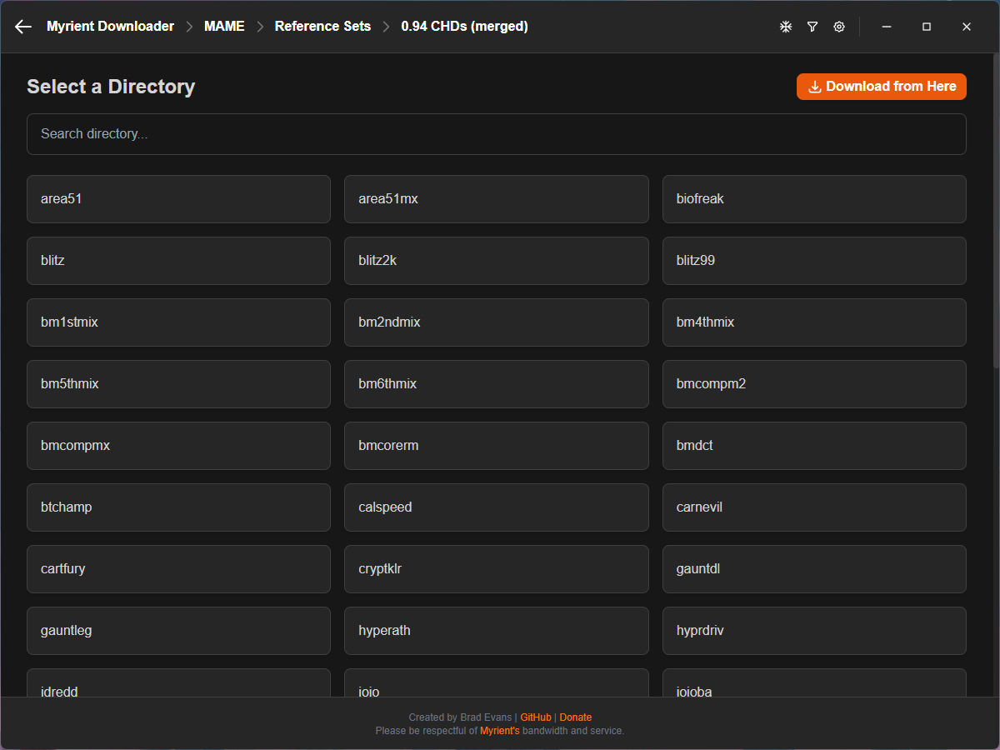
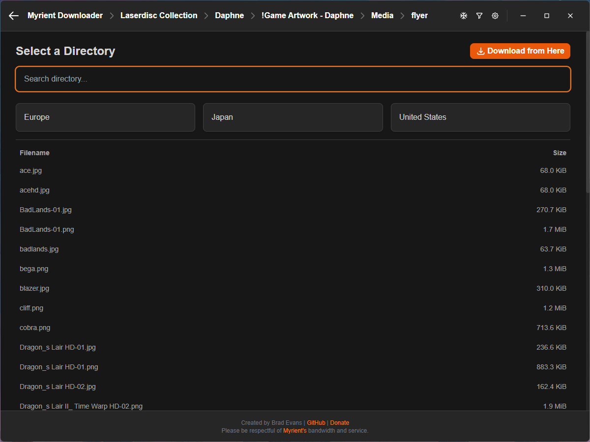

# Myrient Downloader


A powerful, standalone desktop application designed to provide a secure and efficient interface for accessing, filtering, and downloading public domain game archives from the [Myrient](https://myrient.erista.me/) library.

Download the latest release here:

[](https://github.com/bradrevans/myrient-downloader/releases)

*You will need to clone the repository and build the application yourself using the instructions in this README if you want to run the application on a Mac.*

Please consider donating to support my work and Myrient's service.

<a href="https://ko-fi.com/bradrevans"></a>

<a href="https://myrient.erista.me/donate/"></a>

***

## What the Application Does

The Myrient Downloader provides a seamless process for creating curated game collections:
1.  **Browse and Select:** Allows users to easily browse and search the entire Myrient catalog of archives (e.g., No-Intro, MAME) and drill down into specific systems or categories.
    * **Download Anywhere:** Download from the directory of your choice, recursively finding all files beneath your chosen directory.
    * **See Files:** See and search the files at your currently selected directory so you know what you will be downloading when you click "Download from Here".
2.  **Optionally Filter and Curate:** Presents a powerful wizard to filter thousands of files down to a specific list based on custom rules:
    * **Include/Exclude Tags:** Filter files by region or language tag (e.g., keep only `(USA)`).
    * **Revision Control:** Automatically select only the single highest revision of every game title.
    * **Multi-Disc/Cart:** Automatically download all discs or cartridges for a given title.
    * **Priority De-duplication:** Allows the user to build a priority list of tags to select the *best* version when multiple unique copies of a game exist.
    * **Include/Exclude String Filters:** Create custom lists of strings to match titles to include and exclude.
    * **Save/Import/Export Filtering Presets:** Save your filtering options as presets to re-use them or share them with friends. All filtering options are included and work at every directory level.
    * **Skip The Filtering:** Don't need to filter? Go ahead and skip it! Archives that don't support tags will skip the filtering automatically.
3.  **Download:** Executes the download of the final, filtered list of files.
    * **Include/Exclude Individual Titles:** Toggle download for titles on and off individually.
    * **Directory Management:** Match the remote directory structure or automatically create sub directories for every title. If you target a directory with a conflicting folder structure you will be warned before continuing.
    * **Extract Archives:** Automatically extract files and delete the original archives. It will even do this for things you previously downloaded.
    * **Control Download Speed:** Throttle download speeds to download in the background without saturating your bandwidth.
4.  **Manage Progress:** Displays a live overall size-based progress bar with an **accurate time remaining estimate**. It handles file skipping for existing archives and provides a safe cancellation will delete incomplete files.
    * **Skip The Scan:** If you're not bothered about accurate file size estimates, download times or resuming incomplete downloads you can skip the pre-download scan and start downloading more quickly.
    * **Smart Resuming:** The application can **scan for existing local files** and automatically resume the download from the point it left off (even if you didn't scan when you first started downloading). Files that are fully downloaded are skipped, ensuring efficient use of bandwidth. This also works for extraction.
    * **Partial File Notation:** Files that are partially downloaded or extracted will be marked with a `.part` extension; allowing you to start moving your files around with confidence that they're complete.
5. **Quality of Life:** A variety of features and visual queues help you to use the application.
   * **Tooltips:** Helpful informative tooltips are scattered across the UI to help explain how things work.
   * **Update Notification:** Get notified when a new version is available for download.
   * **Settings Menu:** A settings menu lets you check for updates and adjust application zoom levels for better support across a variety of displays.
   * **Keyboard Navigation:** Using your arrow keys and enter you can navigate many of the UI elements quickly and efficiently.
   * **Toast Notification:** Little pop-ups that confirm whether actions were successful or unsuccessful.
   * **Seasonal Effects:** Optional effects you can toggle on at various times of year.

*And much, much more...*
  
***

## Screenshots

*Select your directory.*


*Navigate through the directory tree to any level.*


*Preview directories and files at your current level.*


*Load a Preset or Include/exclude tags.*


*Include/exclude strings and set your filtering preferences.*


*Prioritise your tags, save your preset and apply your filters.*


*Select your titles.*


*Configure your download options.*


*Monitor your progress.*


*Warnings when target directories differ from your desired folder structure.*


*Optionally, skip filtering all together if you're after something specific.*


*Get notified when a new version is available.*


*Check for updates or adjust zoom levels.*


*Import, export or delete your presets.*

***

## Requirements & Installation (Source Code)

**This section is for developers or users who want to run the application from the source code (instead of downloading a pre-compiled executable), or build their own executable.**

**Reccomended Node Version:** 20.9.0

1.  **Clone/Download:** Get all the files from this repository.

2.  **Install Dependencies:** Open a terminal in the project's root folder (where `package.json` is) and run:

    ```bash
    npm install
    ```

3.  **Run the App (Development Mode):**

    ```bash
    npm start
    ```

***

## Building Standalone Executables

The project is configured with `electron-builder` to generate ready-to-run executables for major operating systems.

### Build Commands

| Target OS | Command | Output |
| :--- | :--- | :--- |
| **Windows** | `npm run build:win` | Portable `.exe` |
| **macOS** | `npm run build:mac` | `.dmg` |
| **Linux** | `npm run build:linux` | `.AppImage` |
| **Current OS (All)** | `npm run build:all` | Target for the current OS |

## Disclaimer

Please make sure to follow all legal and ethical guidelines when using this program.
Downloading and using copyrighted material without proper authorization may violate copyright laws in your country.

This is a web-scraping tool. Please be respectful of [Myrient's](https://myrient.erista.me/) bandwidth and service. This tool would not exist if it wasn't for them.
